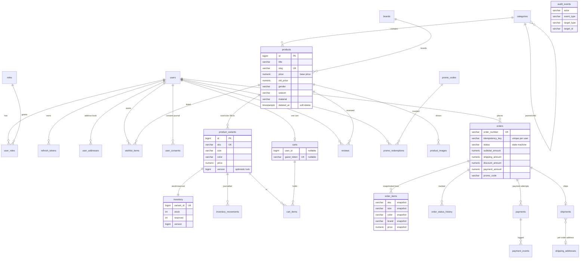

# Доменная модель / ER-диаграмма



Замечания:

- `order_items` — неизменяемый снапшот (ORD-02): изменение каталога не меняет
  историю заказов; `audit_events` не связана FK — переживает удаление сущностей.
- `inventory.reserved` держат только неоплаченные заказы; доступно к продаже
  `stock - reserved`.
- Статусы заказа: CREATED → PENDING_PAYMENT → PAID → PROCESSING → SHIPPED →
  DELIVERED → COMPLETED, ветки CANCELLED (до оплаты) и REFUNDED (после).
```
